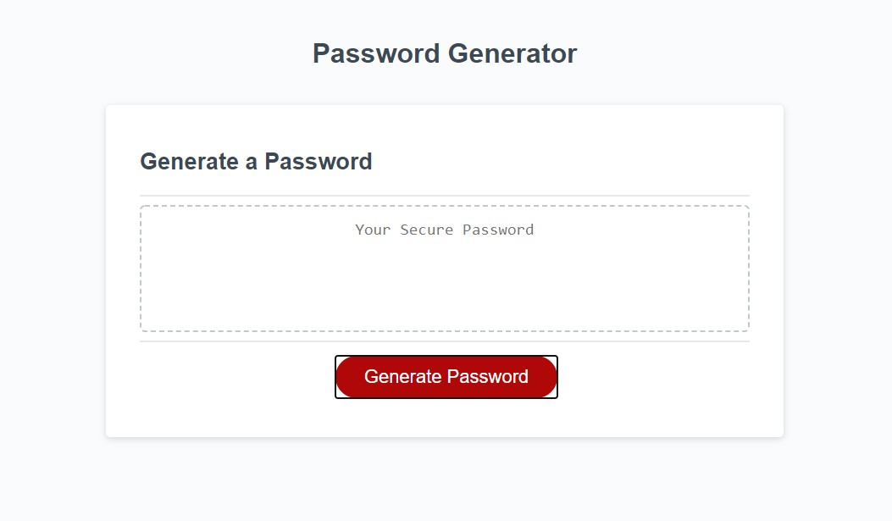

# The Password Generator

## Objective

Create an application that a user can generate a random password based on criteria they have selected. The user can choose a character length between 8 and 128. They can also choose if they want to include lowercase, uppercase, numeric, and/or special characters. When all prompts are answered, a password that matches the selected criteria is generated and displayed on the page.

## Review

- Deployed application: [https://rogerscl116.github.io/the-password-generator](https://rogerscl116.github.io/the-password-generator)   
- GitHub repository: [https://github.com/rogerscl116/the-password-generator](https://github.com/rogerscl116/the-password-generator)

## Screenshot

*Created by Charity Rogers*